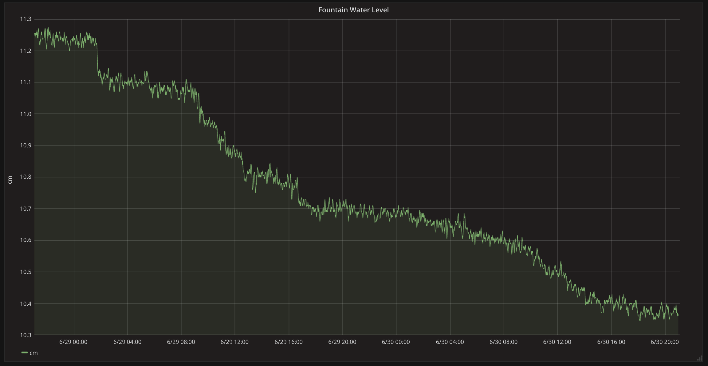

# FountainMQTT

[Adafruit HUZZAH32](https://www.adafruit.com/product/3405) source code for reading a Milone Technologies
[eTape assembly](https://www.adafruit.com/product/2656) for water level and then send the value via MQTT.

 MQTT message is approximately the water level in milimeters x 10.

Note: the eTape assembly is 0-5 VDC and the ESP32 is a 3.3 VDC device.  This equates to ~9" max on the 12" tape. In my use case, 7" is overflowing so this works for me. If you need more range, use a voltage divider to bring down the max voltage from the eTape.

